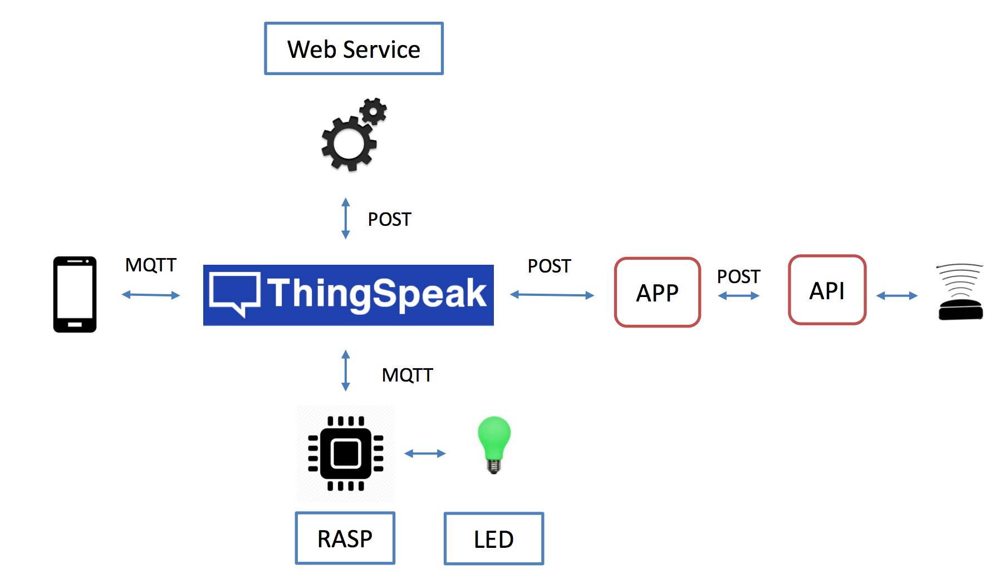

= Smart Parking IoT - Solution

This is a documentation about an Internet of Things system for smart parking.

== Introduction

The Smart Parking IoT is a system that proposes a solution for parkings. 
Its aim is designate a free parking lot for a car comming. The Smart Parking 
IoT sends the chosen parking lot to the car driver smartphone and opens the gate.
Thus, the driver can go directly to the parking lot designated for him.

== Architecture

This project is composed by the components listed bellow:

	* RFID Reader: detects the car comming to the parking entrance.
	* Java APP: consums the data collected by the API used to connect the RFID Reader.
	* Web Service: the intelligence of the project. Its aim is choose a free parking lot and store all the data of the system.
	* ThingSpeak - IoT Plataform: see https://thingspeak.com/.
	* User Smartphine: receive the notification of the free parking lot.
	* Raspberry: manages the parking lot sensors according to the "commands" send from the Web Service.

== Web Service

This section describes how you can make HTTP requests for the web service.
When a car comes, its necessary notificate the web service. 
It can be done sending a post request as described bellow:

----
 $ post http://[host]/entrance/car
----
The body of the request must be:
----
 { 
	tagValue : "String value"
 }
----

The response is the free parking lot chosen.

To send a request for notificating the change of parking lot state, just post request like bellow:
----
$ post http://[host]/parking/occupy
----
The body of the request must be:
----
 {
	number : Integer,
	state  : [0,1,2]
 }
----

